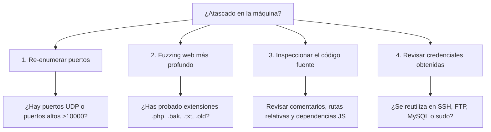

# 🧠 Knowledge Base: CTF Methodology

Metodología práctica y consejos para abordar cualquier reto CTF (Jeopardy o Boot2Root) sin bloquearse.

---

## 📌 Las Reglas de Oro

1. **La enumeración es el 90% del éxito**: Si estás atascado, casi siempre significa que te has saltado un puerto, un subdominio, un parámetro en la web o un comentario en el código.
2. **Toma notas estructuradas en tiempo real**: Registra cada puerto, cada credencial encontrada y cada idea descartada para no repetir pruebas inútilmente.
3. **Comprende el vector antes de ejecutar**: No lances herramientas automáticas sin entender qué peticiones están enviando.

---

## 🚧 ¿Qué hacer cuando te quedas atascado? (Stuck Checklist)



---

## 📝 Plantilla de Notas Rápidas para cada Reto

```markdown
# [Nombre de la Máquina] - [Plataforma]
* IP: 10.10.X.X
* SO: Linux / Windows
* Dificultad: Fácil / Media / Difícil

## Puertos Abiertos
- 22: OpenSSH
- 80: Apache 2.4.X -> Descubierto portal /admin

## Credenciales Encontradas
- admin : Welcome123! (hash crackeado)

## Vector de Acceso Inicial
- Vulnerabilidad: LFI en /view.php?file=
- Payload: php://filter/...

## Escalada de Privilegios
- Comando: sudo -l -> /usr/bin/find
- Explotación: sudo find . -exec /bin/sh \; -quit
```
