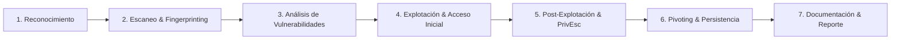

# ⚔️ Knowledge Base: Pentesting Methodology

Flujo de trabajo estandarizado para pruebas de penetración (PTES) aplicadas tanto a auditorías reales como a laboratorios CTF.

---

## 🧭 Fases del Pentesting

---

## 📋 Checklist Rápida por Fase

### Fase 1: Reconocimiento Pasivo & Activo
- [ ] Búsqueda de subdominios (`sublist3r`, `amass`, `crt.sh`).
- [ ] Detección de tecnologías expuestas (`whatweb`, `wappalyzer`).
- [ ] Búsqueda en fuentes abiertas (OSINT, GitHub dorks).

### Fase 2: Escaneo & Enumeración
- [ ] Escaneo completo de puertos TCP y UDP principales (`nmap -p-`).
- [ ] Detección de versiones y scripts NSE (`nmap -sV -sC`).
- [ ] Fuzzing de directorios y archivos web (`gobuster`, `feroxbuster`).
- [ ] Enumeración de recursos SMB / NFS compartidos.

### Fase 3 & 4: Explotación
- [ ] Identificación de exploits públicos conocidos (CVEs) para versiones detectadas.
- [ ] Búsqueda de credenciales por defecto o reutilizadas.
- [ ] Pruebas controladas de inyección (SQLi, Command Injection, LFI).
- [ ] Obtención de shell interactiva.

### Fase 5: Post-Explotación
- [ ] Tratamiento de TTY completa.
- [ ] Enumeración manual y automatizada (`LinPEAS`, `WinPEAS`).
- [ ] Extracción de credenciales en memoria, archivos de configuración o historial de bash.
- [ ] Elevación a privilegios de administrador (`root` / `NT AUTHORITY\SYSTEM`).
